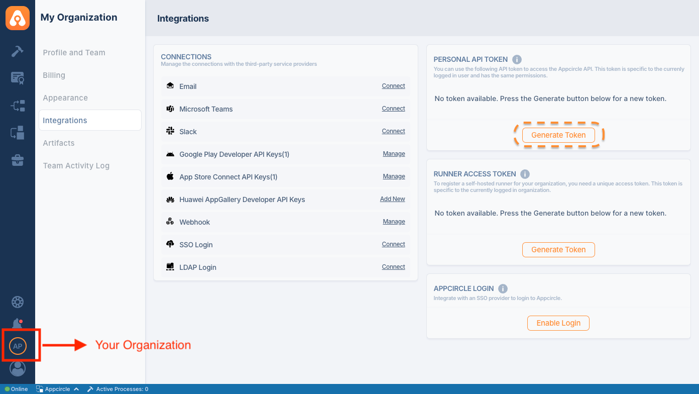

## Appcircle Enterprise App Store

Appcircle Enterprise Mobile App Store is your own mobile app store for providing
access to in-house apps with a customizable mobile storefront.

- **Customizable Storefront:** Distribute your in-house apps with a fully
  customizable mobile storefront.
- **Secure Distribution:** Everything you need for secure, streamlined
  distribution of your in-house apps.
- **No MDM Required:** Allows distribution of B2B and B2E applications without
  the need for an MDM solution and enrollment.

Learn more about
[Appcircle Enterprise App Store](https://appcircle.io/enterprise-app-store?utm_source=github&utm_medium=plugin&utm_campaign=enterprise_app_store).

## What Sets Apart Appcircle Enterprise Mobile App Store

1. **Direct File Sharing:**
   - **Skip Traditional Stores:** Share .IPA, APK, or AAB files directly,
     avoiding the need to wait for Apple App Store or Google Play approvals.
2. **Flexible Sharing Options:**
   - **Beta and Live Modes:** Share your app in ‘beta’ mode for testing new
     features or identifying bugs, or in ‘live’ mode for stable versions. This
     flexibility helps maintain the development lifecycle without interruptions.
3. **Enhanced Security:**
   - **Secure Authentication:** Access the Enterprise Mobile App Store with
     extra secure authentication using Enterprise Authentication Methods.
   - **Controlled Access:** Ensure that only authorized users can access the app
     store and its contents.
4. **Customizable Mobile Storefront:**
   - **Tailored Experience:** Provide a customizable mobile storefront for your
     in-house apps, ensuring a tailored experience that aligns with your brand
     and user needs.
5. **No MDM Requirement:**
   - **Simplified Distribution:** Distribute B2B and B2E applications without
     the need for a Mobile Device Management (MDM) solution or enrollment,
     reducing complexity and costs.
6. **Streamlined Workflow:**
   - **Seamless Integration:** Integrates smoothly with your existing workflow,
     making it easy to manage and distribute apps within your organization.
   - **Efficient Management:** Track and manage applications, versions, testers,
     and teams effectively, ensuring a smooth distribution process.

These features make the Appcircle Enterprise Mobile App Store a powerful tool
for securely and efficiently distributing in-house applications, offering
flexibility, enhanced security, and a streamlined workflow.

### System Requirements

**Compatible Agents:**

- macOS
- Ubuntu
- Ventura

**Supported Version:**

- Jenkins 2.440.3

Note: We currently support **Appcircle Cloud**, with **self-hosted** support
planned in our roadmap.


### Generating/Managing the Personal API Tokens

To generate a Personal API Token:

1. Go to the My Organization screen (second option at the bottom left).
2. Find the Personal API Token section in the top right corner.
3. Press the "Generate Token" button to generate your first token.



## How to use Appcircle Enterprise Store Action

```yml
- name: Publish App to Appcircle Enterprise App Store
  id: store-publish-to-appcircle
  uses: appcircleio/appcircle-enterprise-app-store-githubaction
  with:
    personalAPIToken: ${{ secrets.AC_PERSONAL_API_TOKEN }}
    appPath: APP_PATH
    summary: SUMMARY
    releaseNotes: RELEASE_NOTES
    publishType: PUBLISH_TYPE # "0": None, "1": Beta, "2": Live
```

- `personalAPIToken`: The Appcircle Personal API token is utilized to
  authenticate and secure access to Appcircle services, ensuring that only
  authorized users can perform actions within the platform.
- `appPath`: Indicates the file path to the application that will be uploaded to
  Appcircle Testing Distribution Profile.
- `releaseNote`: Contains the details of changes, updates, and improvements made
  in the current version of the app being published.
- `Summary`: Used to provide a brief overview of the version of the app that is
  about to be published.
- `publishType`: Specifies the publishing status as either none, beta, or live,
  and must be assigned the values "0", "1", or "2" accordingly.

**If two builds start simultaneously, such as v1.0.5(5) and v1.0.5(5), for the
same publishType, the build that finishes last will result in failure because
the same version cannot be added, while the first build to complete will be
successfully uploaded and published.**

### Leveraging Environment Variables

Utilize environment variables seamlessly by substituting the parameters with
${{ envs.VARIABLE_NAME }} in your task inputs. The action automatically
retrieves values from the specified environment variables within your pipeline.

If you would like to learn more about this action and how to utilize it in your
projects, please
[contact us](https://appcircle.io/contact?utm_source=github&utm_medium=plugin&utm_campaign=enterprise_app_store)

### Reference

For more detailed instructions and support, visit the
[Appcircle Enterprise App Store documentation](https://appcircle.io/enterprise-app-store?utm_source=github&utm_medium=plugin&utm_campaign=enterprise_app_store).
